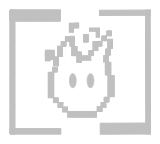

# Fhir (HL7)

_Data sem atrito_

  

Trabalhar com dados em saúde é um desafio grande, uma das premissas fundamentais desse tipo de dado é a posse e a interoperabilidade. A interoperabilidade é a possibilidade de um dado em saúde, que ainda que esteja no domínio da sua aplicação ainda é de posse do cliente, transitar entre sistemas/aplicações não necessariamente dos mesmos fornecedores a depender da consessão do paciente/cliente.

O HL7 Fhir é um padrão de conformidade dos dados de saúde utilizado internacionalmente para transição mencionada acima. Se assemelha a uma [orientação a dados](https://blog.klipse.tech/dop/2022/06/22/principles-of-dop.html) não muito comum em softwares atuais mas essencial para as regras de negócio em saúde.

> A princípio os componentes serão "documentados" em português nos testes e em inglês no próprio código com JsDoc.

---

## Justificativa
