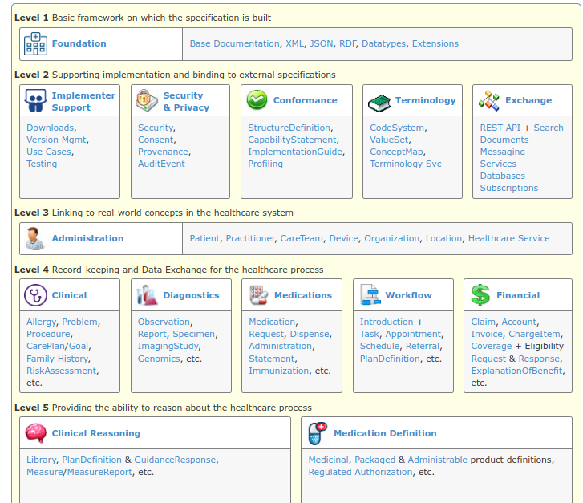
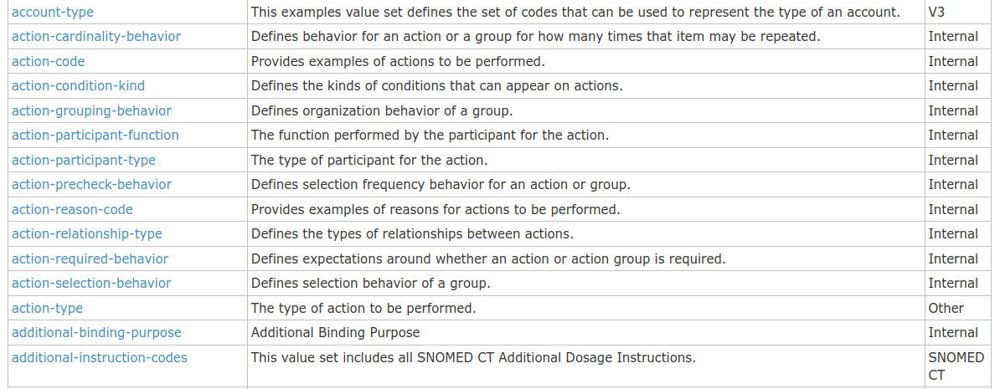

<div align="center">

# Fhir (HL7)


_Data sem atrito_

<br> 

</div>

Trabalhar com dados em saúde (Medicina/Saúde Digital) é um desafio grande. Uma das premissas fundamentais desse tipo de dado a interoperabilidade. A interoperabilidade é a possibilidade de um dado em saúde transitar entre sistemas/aplicações que não necessariamente estão na mesma infraestrutura. Alguns autores consideram a interoperabilidade como ponto de início para o desenvolvimento da área e que o esforço de implementação deve acontecer por um conjunto de profissionais tanto da área da saúde como da tecnologia da informação¹. Com o advento da covid-19 muitos pesquisadores retomaram a discussão sobre a importância desse tema² e alguns países propuseram modelos de dados a serem aplicados na rotina de atendimento e pesquisa³-⁴.

O HL7 FHIR é um padrão de conformidade dos dados de saúde utilizado internacionalmente para interoperabilidade e tem ganhado adoção de muitos projetos em saúde⁵. Do ponto de vista prático ele se assemelha a uma [orientação a dados](https://blog.klipse.tech/dop/2022/06/22/principles-of-dop.html) [figura 1] aonde a lógica de aplicação é separada da persistência e camada de dados. Ainda que não seja muito comum em softwares atuais existem padrões comportamentais que já trabalham dessa forma, como o [Data Access Object (DAO)](https://en.wikipedia.org/wiki/Data_access_object). **Esse comportamento é esperado e essencial para as regras de negócio em saúde.**

<br>


<div align="center"> Figura 1 </div>


**Refs**

¹ Lehne M, Sass J, Essenwanger A, Schepers J, Thun S. Why digital medicine depends on interoperability. NPJ Digit Med. 2019 Aug 20;2:79. doi: 10.1038/s41746-019-0158-1. PMID: 31453374; PMCID: PMC6702215.

² Arianna Dagliati, Alberto Malovini, Valentina Tibollo, Riccardo Bellazzi, Health informatics and EHR to support clinical research in the COVID-19 pandemic: an overview, Briefings in Bioinformatics, Volume 22, Issue 2, March 2021, Pages 812–822, https://doi.org/10.1093/bib/bbaa418

³ Shanbehzadeh M, Kazemi-Arpanahi H, Valipour AA, Zahedi A. Notifiable diseases interoperable framework toward improving Iran public health surveillance system: Lessons learned from COVID-19 pandemic. J Educ Health Promot. 2021 May 31;10(1):179. doi: 10.4103/jehp.jehp_1082_20. PMID: 34250113; PMCID: PMC8249955.

⁴ Development of interoperable, domain-specific extensions for the German Corona Consensus (GECCO) COVID-19 research dataset using an interdisciplinary, consensus-based workflow. Gregor Lichtner, Thomas Haese, Sally Brose, Larissa Röhrig, Liudmila Lysyakova, Stefanie Rudolph, Maria Uebe, Julian Sass, Alexander Bartschke, David Hillus, Florian Kurth, Leif Erik Sander, Falk Eckart, Nicole Toepfner, Reinhard Berner, Anna Frey, Marcus Dörr, Jörg Janne Vehreschild, Christof von Kalle, Sylvia Thun
medRxiv 2022.05.12.22274089; doi: https://doi.org/10.1101/2022.05.12.22274089

⁵ Duda SN, Kennedy N, Conway D, Cheng AC, Nguyen V, Zayas-Cabán T, Harris PA. HL7 FHIR-based tools and initiatives to support clinical research: a scoping review. J Am Med Inform Assoc. 2022 Aug 16;29(9):1642-1653. doi: 10.1093/jamia/ocac105. PMID: 35818340; PMCID: PMC9382376.

<br>

---

## Justificativa
A maior _lib_ e provavelmente o caso de uso mais bem sucedido até então é a [Hapi-FHIR](https://hapifhir.io/) com 18 anos de implementação em Java e atualmente na 6ª versão, ela fornece desde de uma implementação "baixo nível" para se trabalhar com os Recursos do HL7 FHIR até abstrações para serviços como as interfaces de um servidor FHIR por API.

Para outras linguagens de programação é posssível procurar no repositório [Confluence](https://confluence.hl7.org/) as implementações open-source que já foram divulgadas. Enquanto algumas linguagens como .NET e Java possuem suas _libs_ de referência, outras como Python e Javascript não as possuem, tendo que buscar em um número considerável de alternativas quais que melhor se encaixam na sua regra de negócio.

A seguir iremos avaliar as opções que existem para Javascript mas a existência desse repositório busca iniciar um processo de correção das desvantagens mencionadas a seguir.

<br>

### Medplum

|   |   |
|---|---|
| **Fonte**: | https://github.com/medplum/medplum. |
| **Descrição**:  | De longe essa a implementação mais bem sucedida em Javascript/Typescript. Implementa lógicas bem avançadas de autenticação SMART, agendamento de consultas, criação de Usuários (Practitioner, Patient e RelatedPerson) e de certa forma pode ser considerada padrão ouro (algo a ser atingido) nesse repositório.  |
| **Vantagens**:  | Os fluxos implementados funcionam, ainda que não estejam bem evidentes como separação de objetos de domínio, casos de uso e etc.  |
| **Desvantagens**:  | Implementa muitos ResourceTypes e DataTypes como interfaces, sem fazer uso de Types ou Generics, que é uma base bem forte do desenvolvimento em FHIR. |

<br>

### @types/fhir

|  |  |
|--|--|
| **Fonte**:  | https://www.npmjs.com/package/@types/fhir |
| **Desvantagens**: | Apenas implementa os tipos necessários para ser utilizado no HL7 FHIR. |

<br>

### Fhir.js

|  |  |
|--|--|
|**Fonte**: | https://github.com/FHIR/fhir.js |
| **Vantagens**: |  É A implementação em JS mais usada para HL7 FHIR. |
| **Desvantagens**: | Sem atualizações desde 2019 e não tem tipagem. |

<br>

### node-fhir-server-core

|  |  |
|--|--|
| **Fonte**: | https://github.com/bluehalo/node-fhir-server-core |
| **Descrição**: | Também uma implementação muito bem sucedida para as lógicas de backend de um servidor FHIR. |
| **Vantagens**: |  Integração como o Node, Express e Mongo. |
| **Desvantagens**:  | Acoplamento de código e lógicas de design de software inexistentes. |

<br>

> Todas as outras implementações abordam lógicas de negócios específicas que não valem ser abordadas aqui.

<br>

## Implementação

Essa lib não implementará lógicas de negócio. **Apenas disponibilizará os objetos e as relações necessárias para se implementar regras de negócios para sua aplicação**.

A _initial realease_ desse repositório irá focar em implementar toda a estrutura necessária para implementar o primeiro _usecase_: **Agendamento de consultas**.

Toda a documentação e os testes estarão em português enquanto a documentação interna dos arquivos (JsDoc) estará em inglês, muitas das vezes vindo direto das explicações disponíveis na especificação HL7 FHIR.

<br>

### Estrutura de Pastas

Na _landing page_ da especificação vemos uma separação por níveis de implementação das regras dos Recursos que a princípio não devem ser todos implementados de uma vez sem levar em conta a lógica de sua aplicação.




Para esse primeiro caso de uso as pastas dos níveis 3 (administration) e 4 (clinical, diagnostics, medications, workflow e financial) estarão identificadas no diretório raiz do projeto. Tudo o que não for ValueSet mas ainda precisar ser usado em Recursos desses níveis mencionados estarão dentro da pasta `core` seguindo uma classificação não necessariamente relacionada ao padrão FHIR. Os ValueSets também estarão disponíveis no diretório raiz dentro da pasta `values`. O que precisar ser compartilhados entre as pastas estará na pasta `shared`, enquanto as excessões dos sistema estarão na pasta `errors`.

<br>

### A questão dos ValueSets

Os ValueSets são como se fossem os Enum no Typescript, eles definem opções específicas de códigos que podem ser utilizados nos ResourceTypes e nos DataTypes. Essas opções são criadas ao se definir um ResourceType do tipo CodeSystem, que descreve todas as propriedades desse sistema de código e disponibiliza em ValueSets nas opções criadas. No entanto, a implementação HL7 FHIR já possui alguns definidos por padrão. 

É possível verificar todos os ValueSets padrão no seguinte local: https://www.hl7.org/fhir/terminologies-valuesets.html.



Repare na última opção "SNOMED CT", nela ocorre um **conflito de licença**. A SNOMED CT é apenas pública para uso comercial em países membros, o que reduziria as opções de uso dessa lib (o próprio Brasil por exemplo não é um país membro.). **Para contonar essa questão os ValueSets que derivarem dessas opções deverão ser definidos pelo usuário, a indicação deles se dará por uma interface.**

Por exemplo, no fluxo do Agendamento o ValueSet que identifica o motivo que levou o paciente a buscar aquela consulta (`EncounterReasonCodes.js`) é um SNOMED-CT e pode ser substituído atualmente pelo capítulo do CID-11 que identifica a mesma coisa.

Vale também ressaltar que os ValueSets muito extensos (>300 opções) não estarão codados, apenas identificados por interface.

> O único Value Set implementado como string direto sem a estrutura do { code, display e description } é o do ResourceType, que identifica o tipo de recurso utilizado.


<br>

## Como Usar

Para o paradigma funcional evite instaciar as classes fora do escopo das funções. Procure utilizar HighOrderFunctions passando outras funções como parâmetros de modo que elas se tornem ações necessárias no escopo da função superior para a conclusão do seu caso de uso. 
```typescript

import { ScheduleSchemaR4B, Schedule, Slot, SlotSchema, Reference } from 'codeplaydata/fhir';

function createSchedule(scheduleData: ScheduleSchemaR4B, /*bussiness logic*/ action: (i: Schedule) => any, params: any) {
    //...
    // bussiness logic
    const schedule = new Schedule(scheduleData);
    //...
    //bussiness logic
    let result = action.apply(schedule, params);
    return {
        schedule,
        result
    }
}

function setScheduleSlots(schedule: Schedule, slotsData: SlotsSchemas[]) {
    let slots: Slot[] = [];
    slots.map((i: SlotSchema) => {
        let slot = new Slot(i);
        // bind the slots to one schedule
        slot.schedule = new Reference(schedule);
        slots.push(new Slot(i))
    })
    return [...slots]
}

createSchedule(
    {<scheduleSchema>},
    setScheduleSlots,
    [<slotsSchemas>]
)

```

Para a orientação a objetos extenda as classes dos recursos FHIR HL7 fornecidas definindo sua regra de negócio.

```typescript
import { Schedule as ScheduleBase } from 'codeplaydata/fhir';

class Schedule extends ScheduleBase {
    renew() {}
    revoke() {}
    //...
}

```
<br>

## Licenças

 FHIR® is the registered trademark of HL7 and is used with the permission of HL7. Use of the FHIR trademark does not constitute endorsement of this product by HL7.

 <br>

---

<br>

   Copyright 2023 Pedro Paulo Teixeira dos Santos

   Licensed under the Apache License, Version 2.0 (the "License");
   you may not use this file except in compliance with the License.
   You may obtain a copy of the License at

       http://www.apache.org/licenses/LICENSE-2.0

   Unless required by applicable law or agreed to in writing, software
   distributed under the License is distributed on an "AS IS" BASIS,
   WITHOUT WARRANTIES OR CONDITIONS OF ANY KIND, either express or implied.
   See the License for the specific language governing permissions and
   limitations under the License.

